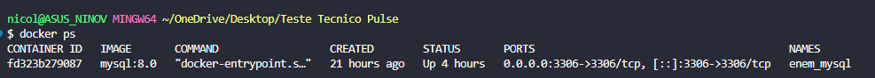
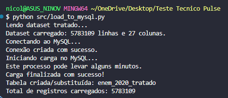
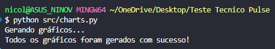
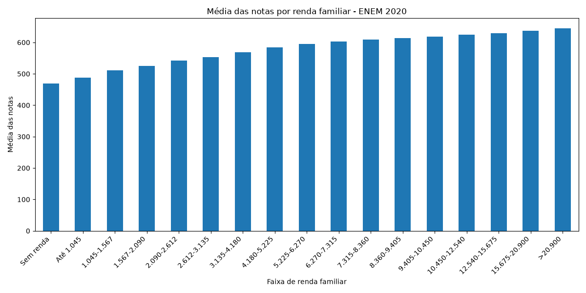
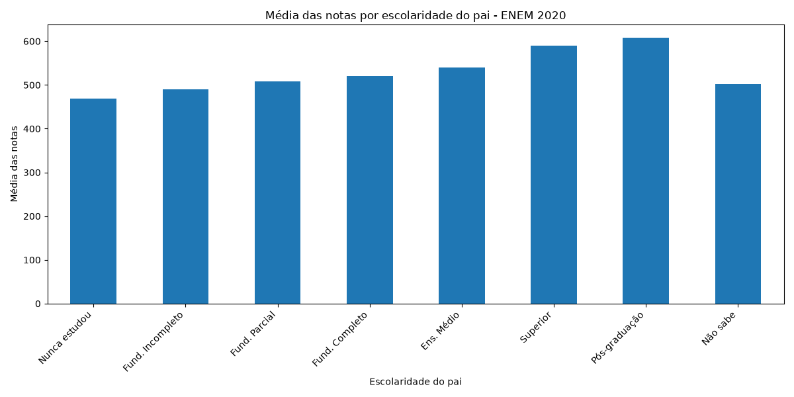
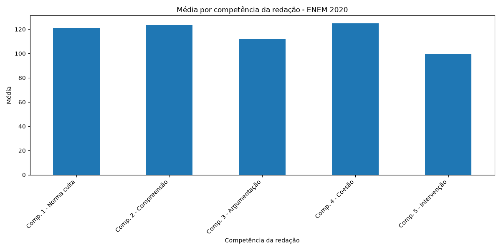
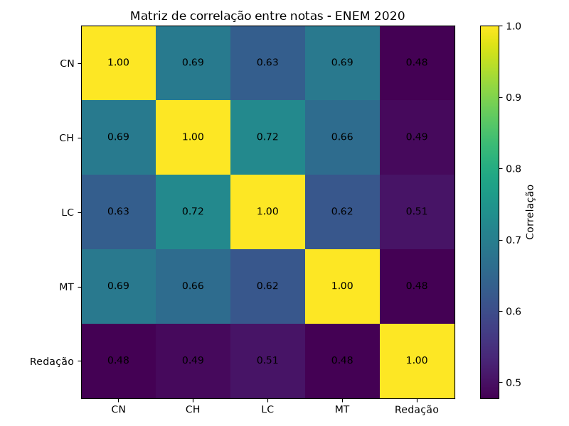

# 📊 Teste Técnico - Analista de Dados (Pulse)

## Sobre o Projeto

Este projeto foi desenvolvido como solução para o teste técnico de Analista de Dados utilizando os microdados do ENEM 2020.

O objetivo foi construir um pipeline completo de ETL (Extract, Transform, Load), realizar a modelagem dos dados, carregar as informações para um banco MySQL executando em Docker, gerar indicadores, produzir visualizações e realizar análises exploratórias sobre os dados disponibilizados.

Durante o desenvolvimento foram priorizados:

* Organização do código;
* Clareza da implementação;
* Separação de responsabilidades;
* Documentação;
* Reprodutibilidade do processo;
* Interpretação dos resultados.

---

# 🚀 Tecnologias Utilizadas

* Python 3
* Pandas
* Matplotlib
* SQLAlchemy
* MySQL 8
* Docker
* Docker Compose
* SQL

---

# 📁 Estrutura do Projeto

```text
teste_tecnico_pulse/

├── dados/
│   ├── ITENS_PROVA_2020.csv
│   └── MICRODADOS_ENEM_2020.csv
│
├── dicionario/
│   ├── Dicionário_Microdados_Enem_2020.xlsx
│   └── Dicionário_Microdados_Enem_2020.ods
│
├── docs/
│   ├── images/
│   ├── modelagem_dimensional.md
│   └── queries.sql
│
├── inputs/
│   └── enem_2020_tratado.csv
│
├── outputs/
│   └── indicadores.txt
│
├── src/
│   ├── charts.py
│   ├── create_clean_dataset.py
│   ├── explore.py
│   ├── indicators.py
│   └── load_to_mysql.py
│
├── docker-compose.yml
├── requirements.txt
└── README.md
```

---

# 🔄 Pipeline ETL

```text
MICRODADOS_ENEM_2020.csv

                │

                ▼

        Extração dos dados

                │

                ▼

 Seleção das colunas relevantes

                │

                ▼

 Criação das variáveis:

    • NOTA_TOTAL
    • MEDIA_NOTAS
    • AUSENTE

                │

                ▼

      enem_2020_tratado.csv

                │

                ▼

        Carga para MySQL
         (Docker + SQLAlchemy)

                │

                ▼

      Indicadores + SQL +
     Visualizações + Insights
```

---

# 🔧 Transformações Realizadas

Durante o processo ETL foram realizadas:

* Seleção das colunas relevantes;
* Criação da variável `NOTA_TOTAL`;
* Criação da variável `MEDIA_NOTAS`;
* Criação da variável booleana `AUSENTE`;
* Exportação do dataset tratado;
* Carga automática para MySQL.

---

# 📦 Dataset Tratado

O dataset tratado foi gerado a partir dos microdados oficiais do ENEM 2020, contendo apenas as colunas relevantes para as análises propostas no desafio.

Variáveis adicionais criadas durante o ETL:

- NOTA_TOTAL
- MEDIA_NOTAS
- AUSENTE

Arquivo gerado:

inputs/enem_2020_tratado.csv

---

# ⭐ Modelagem Dimensional

Foi elaborada uma proposta de modelagem dimensional documentada em:

```text
docs/modelagem_dimensional.md
```

A estrutura considera uma tabela fato contendo os indicadores de desempenho e dimensões relacionadas ao participante e às características socioeconômicas disponíveis na base.

---

# 🐳 Docker + MySQL

O processo de carga contempla:

- Inicialização do container Docker;
- Conexão ao banco MySQL;
- Leitura do dataset tratado;
- Carga automática utilizando SQLAlchemy;
- Atualização da tabela através de `if_exists="replace"`.

## Container MySQL em execução



## Carga para MySQL

Execução do processo de carga do dataset tratado.



---

# 📈 Indicadores Gerados

Foram implementados indicadores para responder às questões propostas no desafio:

* Total de inscritos;
* Percentual de ausentes;
* Média geral;
* Aluno com maior média;
* Média por disciplina;
* Média por sexo;
* Média por etnia;
* Município com maior média (informação complementar).

Os resultados completos encontram-se em:

```text
outputs/indicadores.txt
```

---

# 📊 Visualizações Produzidas


## Execução da geração dos gráficos



---

## Média por renda familiar



---

## Escolaridade da mãe


---

## Escolaridade do pai



---

## Competências da Redação



---

## Matriz de Correlação



---

# 💾 Consultas SQL

Foram implementadas consultas contemplando:

* COUNT
* AVG
* GROUP BY
* WHERE
* ORDER BY
* LIMIT

Arquivo:

```text
docs/queries.sql
```

---

# 🔍 Principais Insights

1. As provas objetivas apresentam correlação positiva moderada a forte entre si.

2. A redação apresentou correlação inferior às demais provas objetivas, sugerindo comportamento relativamente mais independente.

3. Linguagens apresentou a maior correlação com a nota da redação dentre as disciplinas objetivas.

4. Observa-se tendência crescente entre renda familiar e desempenho médio.

5. O aumento da escolaridade da mãe está associado a maiores médias observadas.

6. A escolaridade do pai apresenta comportamento semelhante.

7. A Competência 5 apresentou a menor média dentre as competências avaliadas.

8. A Competência 4 apresentou o melhor desempenho médio.

9. As competências da redação apresentaram distribuição relativamente homogênea.

10. A análise conjunta sugere associação entre fatores socioeconômicos e desempenho acadêmico, sem permitir inferências de causalidade apenas com base nesta análise descritiva.

---

# ⚠️ Limitações da Base

A base oficial disponibilizada para o desafio não contém identificador único ou nome da instituição de ensino (`CO_ESCOLA` ou `NO_ESCOLA`).

Por esse motivo, optou-se por não inferir uma resposta incorreta para a pergunta referente à escola com maior média, apresentando apenas uma análise complementar por município.

As interpretações apresentadas possuem caráter exploratório e não estabelecem relações de causa e efeito.

---

# ▶️ Como Executar


## 1. Clonar o repositório

```bash
git clone <URL_DO_REPOSITORIO>
cd teste_tecnico_pulse
```

---

## 2. (Opcional, mas recomendado) Criar um ambiente virtual

### Windows

```bash
python -m venv .venv
.venv\Scripts\activate
```

### Linux / macOS

```bash
python -m venv .venv
source .venv/bin/activate
```

---

## 3. Instalar as dependências

```bash
pip install -r requirements.txt
```

---

## 4. Inicializar o MySQL com Docker

```bash
docker compose up -d
```

Verificar se o container está em execução:

```bash
docker ps
```

---

## 5. Gerar o dataset tratado

```bash
python src/create_clean_dataset.py
```

---

## 6. Carregar os dados para o MySQL

```bash
python src/load_to_mysql.py
```

---

## 7. Gerar os indicadores

```bash
python src/indicators.py
```

---

## 8. Gerar as visualizações

```bash
python src/charts.py
```

---

## Arquivos gerados

### Dataset tratado

```text
inputs/enem_2020_tratado.csv
```

### Indicadores

```text
outputs/indicadores.txt
```

### Visualizações

```text
docs/images/
```

---

# ✅ Requisitos Atendidos

* ✔ Docker
* ✔ SQL
* ✔ Python
* ✔ Organização do Código
* ✔ Documentação
* ✔ ETL
* ✔ Modelagem Dimensional
* ✔ Esquema Estrela (proposta)
* ✔ Indicadores
* ✔ Visualizações
* ✔ Análise Exploratória
* ✔ Correlação entre variáveis
* ✔ Resumo de Insights


## 👨‍💻 Autor

Desenvolvido por Nicolas Eduardo Ninov Stalter como solução para o Teste Técnico de Analista de Dados.

LinkedIn:
https://linkedin.com/in/nicolas-ninov/

GitHub:
https://github.com/nicolas-ninov
